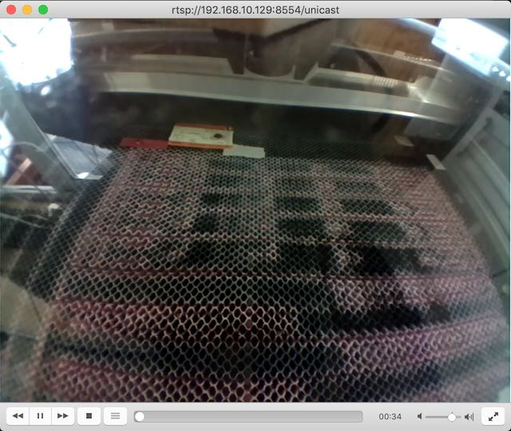

# Raspberry Pi Zero based RTSP (streaming) Camera

This is a simple webcam that uses a Raspberry Pi Zero wireless with a Pi Camera and streams the images using RTSP.

## Hardware
- Raspberry Pi Zero Wireless
- [Pi Camera with 160° wide-angle lens and variable-focus lens](https://shop.pimoroni.com/products/raspberry-pi-zero-camera-module?variant=3031238213642)

## Software
- Raspbian 10 Buster Lite
- v4l2rtspserver
- nginx

## Background
This configures your Raspberry Pi Zero wireless to act as a RSTP camera server, streaming your Pi camera over the network.  It configures your system from out of the box to having a network video stream.  I use this to monitor my laser cutter.  The camera and Pi are sitting on the transparent lid of my laser cutter facing down, which means I need to flip the horizontal and vertical image.  I have set the resoltion for be 640x480, but you are welcome to change that to whatever suits you best.  It installs nginx as a simple webserver to allow me to quickly see the stream configuration only.  v4l2rtspserver streams the video image from the Pi with minimal CPU overhead. I also use motion/motioneye/motioneyeos running on another server to process and store the streamed images.

## Installation
1. Download Raspbian 10 Buster Lite image from [https://downloads.raspberrypi.org/raspbian_lite_latest](https://downloads.raspberrypi.org/raspbian_lite_latest)
1. Download and install Balener Etcher from [https://www.balena.io/etcher/](https://www.balena.io/etcher/)
1. Write the image to an SD card using Balener Etcher
1. Whilst the SD card is still mounted, edit /Volumes/BOOT/wpa_supplicant.conf, paste in the following, edit and save:
    ```
    country=GB
    ctrl_interface=DIR=/var/run/wpa_supplicant GROUP=netdev
    update_config=1
    network={
      scan_ssid=1
      ssid="your-wifi-network"
      psk="your-wifi-password"
    }
    ```
1. Enable SSH Daemon upon boot: `touch /Volumes/BOOT/ssh`
1. Place SD card into Pi and power it on
1. Discern your Pi's IP address
1. SSH in: `ssh pi@192.168.10.129`
1. Run the following commands:
    ```
    passwd
    sudo su -
    apt-get update
    apt-get upgrade
    apt-get install git cmake nginx vim screen -y
    mkdir ~/git
    cd ~/git
    git clone https://github.com/mpromonet/v4l2rtspserver.git
    cd v4l2rtspserver && cmake . && make && make install
    ```
1. Configure nginx:
    1. `rm /var/www/html/index.nginx-debian.html`
    1. `vim /var/www/html/index.html`
       ```
       <!DOCTYPE html>
       <html>
       <head>
       <title>Glowforge Camera</title>
       </head>
       <body>
       <h1>Glowforge Camera</h1>
       <p>IP: <a href="rtsp://192.168.10.129:8554/unicast">rtsp://192.168.10.129:8554/unicast</a></p>
       <p>Local: <a href="rtsp://glowcam:8554/unicast">rtsp://glowcam:8554/unicast</a></p>
       </body>
       </html>
       ```
1. Change hostname:
    `vim /etc/hostname`
    and change to:
    `glowcam`
1. Enable camera:
    `raspi-config`
    "Update"
    "Interfacing Options" -> "P1 Camera Enable/Disable connection to the Raspberry Pi Camera"
    "Yes"
    "OK"
    "Finish"
1. Disable camera LED:
    `vim /boot/config.txt`
    And add:
    `disable_camera_led=1`
1. Configure RTSP streaming:
    `vim /etc/rc.local` then add the following lines to the bottom of the file BEFORE the `exit 0`
    ```
    v4l2-ctl --set-ctrl video_bitrate=500000
    v4l2-ctl -p 5
    v4l2-ctl --set-ctrl vertical_flip=1
    v4l2-ctl --set-ctrl horizontal_flip=1
    v4l2rtspserver -W 640 -H 480 /dev/video0 &
    ```
1. Reboot via `shutdown -r now`
1. Using VLC access the video stream by visiting `rtsp://192.168.10.129:8554/unicast`



## How to change video streaming settings
In this example setup I have configured it with the following settings:
- a reduced resolution of 640x480, rather than the default of 2592x1944
- a reduced frames per second of 5, rather than 25
- a reduced bitrate of 500000, rather than the default of 1000000
- vertical flip of image
- horizontal flip of image

You can customise these to anything that works best for you.  These settings reduced the bandwidth requirements for me, but in theory you can set it to be 2592x1944 @25fps or even 1080p @30fps, 720p @60fps, or 480p @90fps.

To change the settings, just edit the /etc/rc.local, change these lines and reboot:
```
# Set bitrate to 500000
v4l2-ctl --set-ctrl video_bitrate=500000

# Set frames per second to 5
v4l2-ctl -p 5

# Vertically flip the image
v4l2-ctl --set-ctrl vertical_flip=1

# Horizontally flip the image
v4l2-ctl --set-ctrl horizontal_flip=1

# Set streaming resolution at 640x480
v4l2rtspserver -W 640 -H 480 /dev/video0 &
```

You can change these settings whilst streaming too.


## Video Streaming Settings
```
root@glowcam:~# v4l2-ctl --all
Driver Info:
	Driver name      : bm2835 mmal
	Card type        : mmal service 16.1
	Bus info         : platform:bcm2835-v4l2
	Driver version   : 4.19.97
	Capabilities     : 0x85200005
		Video Capture
		Video Overlay
		Read/Write
		Streaming
		Extended Pix Format
		Device Capabilities
	Device Caps      : 0x05200005
		Video Capture
		Video Overlay
		Read/Write
		Streaming
		Extended Pix Format
Priority: 2
Video input : 0 (Camera 0: ok)
Format Video Capture:
	Width/Height      : 640/480
	Pixel Format      : 'H264' (H.264)
	Field             : None
	Bytes per Line    : 0
	Size Image        : 307200
	Colorspace        : SMPTE 170M
	Transfer Function : Default (maps to Rec. 709)
	YCbCr/HSV Encoding: Default (maps to ITU-R 601)
	Quantization      : Default (maps to Full Range)
	Flags             :
Format Video Overlay:
	Left/Top    : 150/50
	Width/Height: 1024/768
	Field       : None
	Chroma Key  : 0x00000000
	Global Alpha: 0xff
	Clip Count  : 0
	Clip Bitmap : No
Framebuffer Format:
	Capability    : Extern Overlay
			Global Alpha
	Flags         : Overlay Matches Capture/Output Size
	Width         : 640
	Height        : 480
	Pixel Format  : 'YU12'
Streaming Parameters Video Capture:
	Capabilities     : timeperframe
	Frames per second: 5.000 (5000/1000)
	Read buffers     : 1

User Controls

                     brightness 0x00980900 (int)    : min=0 max=100 step=1 default=50 value=50 flags=slider
                       contrast 0x00980901 (int)    : min=-100 max=100 step=1 default=0 value=0 flags=slider
                     saturation 0x00980902 (int)    : min=-100 max=100 step=1 default=0 value=0 flags=slider
                    red_balance 0x0098090e (int)    : min=1 max=7999 step=1 default=1000 value=1000 flags=slider
                   blue_balance 0x0098090f (int)    : min=1 max=7999 step=1 default=1000 value=1000 flags=slider
                horizontal_flip 0x00980914 (bool)   : default=0 value=1
                  vertical_flip 0x00980915 (bool)   : default=0 value=1
           power_line_frequency 0x00980918 (menu)   : min=0 max=3 default=1 value=1
                      sharpness 0x0098091b (int)    : min=-100 max=100 step=1 default=0 value=0 flags=slider
                  color_effects 0x0098091f (menu)   : min=0 max=15 default=0 value=0
                         rotate 0x00980922 (int)    : min=0 max=360 step=90 default=0 value=0 flags=modify-layout
             color_effects_cbcr 0x0098092a (int)    : min=0 max=65535 step=1 default=32896 value=32896

Codec Controls

             video_bitrate_mode 0x009909ce (menu)   : min=0 max=1 default=0 value=0 flags=update
                  video_bitrate 0x009909cf (int)    : min=25000 max=25000000 step=25000 default=10000000 value=500000
         repeat_sequence_header 0x009909e2 (bool)   : default=0 value=0
            h264_i_frame_period 0x00990a66 (int)    : min=0 max=2147483647 step=1 default=60 value=60
                     h264_level 0x00990a67 (menu)   : min=0 max=11 default=11 value=11
                   h264_profile 0x00990a6b (menu)   : min=0 max=4 default=4 value=4

Camera Controls

                  auto_exposure 0x009a0901 (menu)   : min=0 max=3 default=0 value=0
         exposure_time_absolute 0x009a0902 (int)    : min=1 max=10000 step=1 default=1000 value=1000
     exposure_dynamic_framerate 0x009a0903 (bool)   : default=0 value=0
             auto_exposure_bias 0x009a0913 (intmenu): min=0 max=24 default=12 value=12
      white_balance_auto_preset 0x009a0914 (menu)   : min=0 max=10 default=1 value=1
            image_stabilization 0x009a0916 (bool)   : default=0 value=0
                iso_sensitivity 0x009a0917 (intmenu): min=0 max=4 default=0 value=0
           iso_sensitivity_auto 0x009a0918 (menu)   : min=0 max=1 default=1 value=1
         exposure_metering_mode 0x009a0919 (menu)   : min=0 max=2 default=0 value=0
                     scene_mode 0x009a091a (menu)   : min=0 max=13 default=0 value=0

JPEG Compression Controls

            compression_quality 0x009d0903 (int)    : min=1 max=100 step=1 default=30 value=30
```

## v4l2-ctl --log-status
```
root@glowcam:~# v4l2-ctl --log-status

Status Log:

   [58426.609192] bcm2835-v4l2: =================  START STATUS  =================
   [58426.609215] bcm2835-v4l2: Saturation: 0
   [58426.609237] bcm2835-v4l2: Sharpness: 0
   [58426.609250] bcm2835-v4l2: Contrast: 0
   [58426.609261] bcm2835-v4l2: Brightness: 50
   [58426.609274] bcm2835-v4l2: ISO Sensitivity: 0
   [58426.609289] bcm2835-v4l2: ISO Sensitivity, Auto: Auto
   [58426.609301] bcm2835-v4l2: Image Stabilization: false
   [58426.609313] bcm2835-v4l2: Auto Exposure: Auto Mode
   [58426.609324] bcm2835-v4l2: Exposure Time, Absolute: 1000
   [58426.609337] bcm2835-v4l2: Auto Exposure, Bias: 0
   [58426.609349] bcm2835-v4l2: Exposure, Dynamic Framerate: false
   [58426.609360] bcm2835-v4l2: Exposure, Metering Mode: Average
   [58426.609371] bcm2835-v4l2: White Balance, Auto & Preset: Auto
   [58426.609381] bcm2835-v4l2: Red Balance: 1000
   [58426.609392] bcm2835-v4l2: Blue Balance: 1000
   [58426.609404] bcm2835-v4l2: Color Effects: None
   [58426.609415] bcm2835-v4l2: Color Effects, CbCr: 32896
   [58426.609428] bcm2835-v4l2: Rotate: 0
   [58426.609440] bcm2835-v4l2: Horizontal Flip: true
   [58426.609450] bcm2835-v4l2: Vertical Flip: true
   [58426.609461] bcm2835-v4l2: Video Bitrate Mode: Variable Bitrate
   [58426.609472] bcm2835-v4l2: Video Bitrate: 500000
   [58426.609484] bcm2835-v4l2: Compression Quality: 30
   [58426.609497] bcm2835-v4l2: Power Line Frequency: 50 Hz
   [58426.609508] bcm2835-v4l2: Repeat Sequence Header: false
   [58426.609518] bcm2835-v4l2: H264 Profile: High
   [58426.609529] bcm2835-v4l2: H264 Level: 4
   [58426.609539] bcm2835-v4l2: Scene Mode: None
   [58426.609550] bcm2835-v4l2: H264 I-Frame Period: 60
   [58426.609563] bcm2835-v4l2: ==================  END STATUS  ==================
```

## Credits
- [https://kevinsaye.wordpress.com/2018/10/17/making-a-rtsp-server-out-of-a-raspberry-pi-in-15-minutes-or-less/](https://kevinsaye.wordpress.com/2018/10/17/making-a-rtsp-server-out-of-a-raspberry-pi-in-15-minutes-or-less/)
